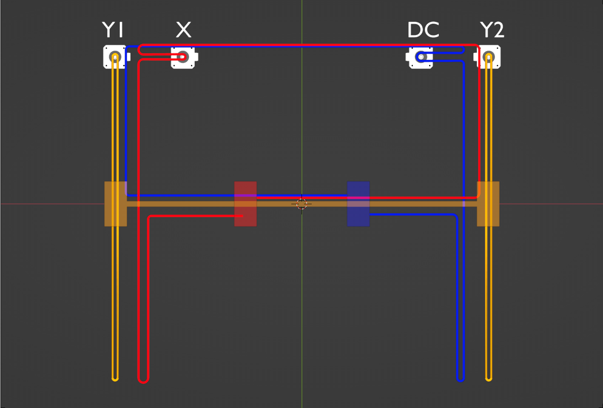
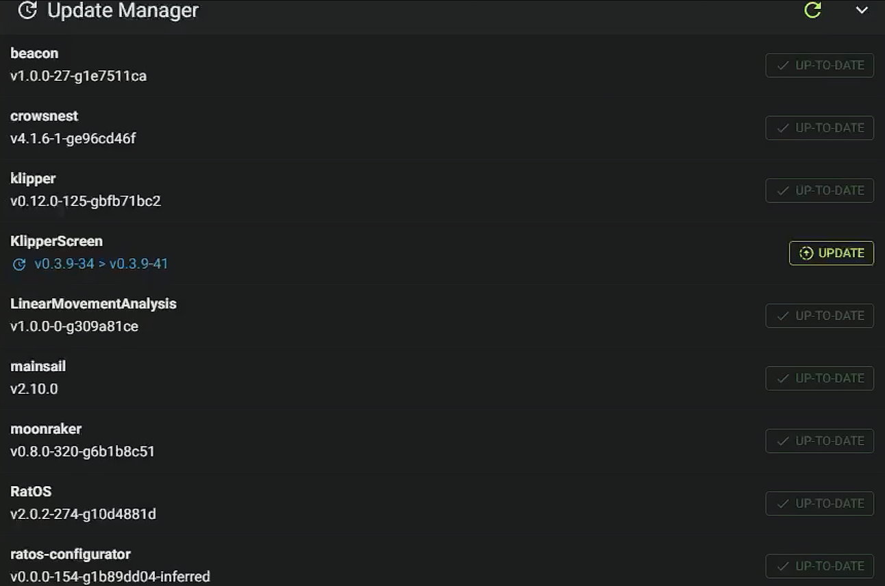
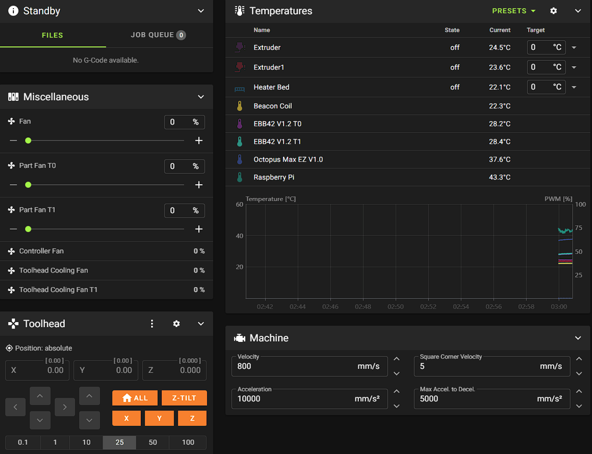
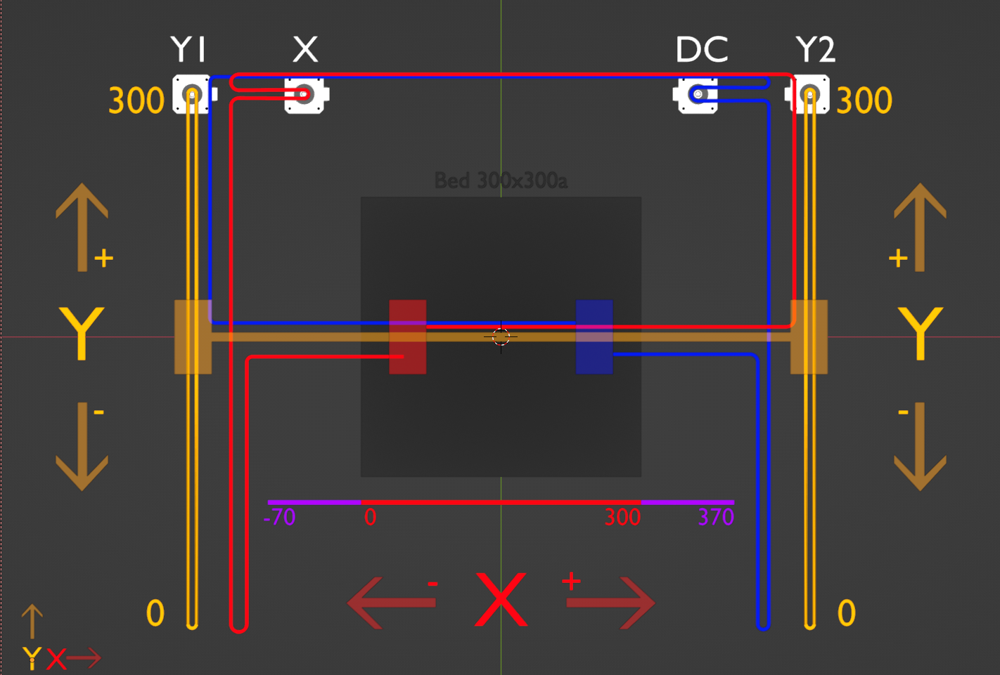
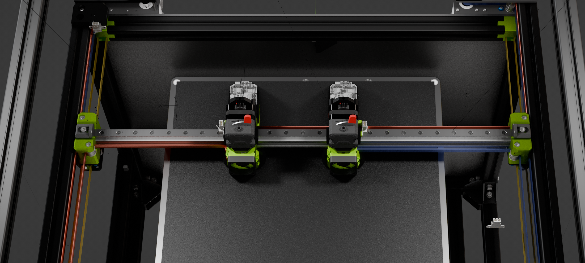
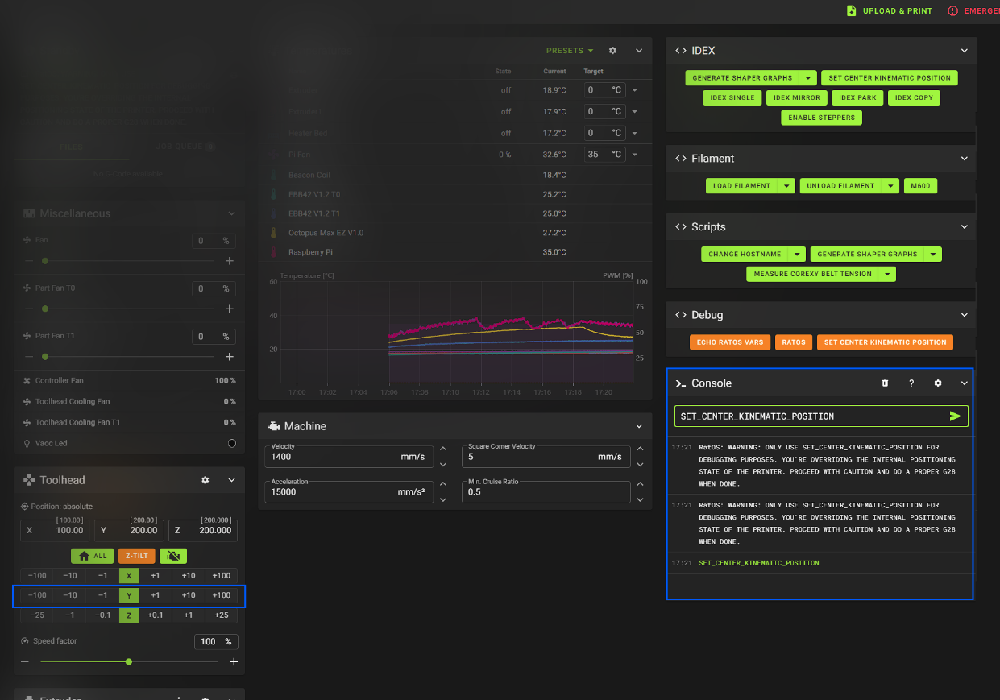

# IDEX - Independent Dual Extruder Post Installation Configuration
> [!NOTE]
> It looks like you installed an IDEX Configuration, before you run anything on your machine, it is STRONGLY recommended to go through this guide before proceeding, unless you know what you are doing.

> [!IMPORTANT]
> IDEX Software is designed, programmed and integrated by **HelgeKeck** and **Miklschmidt**, all credits go to them. I (VisualTech48) am just writing this guide.

> [!CAUTION]
> Disclaimer - You are actually responsible for the operation of your machine, failing to do proper configuration and checks may result in injury or serious damage to your machine!

# Before you start
As the title suggests, we must check the machine and ensure everything is in working order. All examples will follow a Mixed CoreXY kinematics, based on RatRigs IDEX platform, designed by Markforged;
## What is a Hybrid/Mixed CoreXY
The following diagram elaborates on the kinematics of our Hybrid/Mixed CoreXY


Your configuration of motors should follow the current diagram. Where **X** is the **upper motor**, **DC** is the **bottom motor**, and **Y1** and **Y2** mark the **Y motors**.
> [!TIP]
> When doing tension for the IDEX it is recommended to do **X** and **DC** first, ensuring they have the same belt length and tension, and that there is no skew in the X gantry.
>
> You can check this by moving the gantry forward and ensuring the gaps left and right are the same when you tension your X and DC belts. Only after that should you connect the Y tensioners and tension the Y axis of the printer.

If you have confirmed that the gantry moves properly without any stalls or binding you are ready for the next step.

## Mainsail
The next step is to update everything in the **Update Manager**. **The Update Manager** is accessed by going to the "**Machine**" Tab on the left side, and clicking the "**Refresh**" icon in the Update Manager, updating all of the components. 

> [!TIP]
> It is recommended to be up-to-date with Klipper and RatOS especially, as this ensures proper operation.




You should now be able to see all of your components on the "Dashboard" panel if you have everything wired and connected successfully, as showcased in the image below. If that is the case, you are welcome to proceed.


Dashboard example:


## Stepper Direction
> [!CAUTION]
> Do not HOME the device YET! IDEX requires a lot of safety checks before we get to homing! Failing to heed and check proper configuration may result in injuries or damage to your machine!

> [!WARNING]
> Ensure that before any movement, to place your **gantry**, **X** and **DC** to have enough clearance for test movements, refer to the below kinematics picture for an example.

The expected directions for our Hybrid Printer Kinematics, keep that in mind when doing movement testing.



### Preparations
Before any homing or movement, we first need to ensure our X and DC run in the direction we want, please refer to the diagram above for directions! To achive that, we need to use "Set Center Kinematic Position".
> [!WARNING]
> Using SET CENTER KINEMATIC POSITION is ONLY for debugging processes, do not forget to use "**G28**" command or "**Restart Firmware**" before any other motion. This will "trick" the machine that all of our axes are at the centre of the machine.
> 
> To enable it, write `SET_CENTER_KINEMATIC_POSITION` in the console in the Dashboard panel, and press Enter.
> 
> Improper usage of the kinematic movements during this may result in your toolhead and other parts of your printer colliding. Be wary.

Changes are needed in your printer.cfg for this part and as we proceed, so preferably, prepare the "**printer.cfg**" file in another Tab. 
The **"printer.cfg"** is located in the **Machine** Tab, in our config files.


### Testing directions X
> [!NOTE]
> As no motor and configuration are the same, changing the motor direction pins of the 4 following dir_pins is needed. `[dual_carriage]`, `[stepper_x]`, `[stepper_y]`, `[stepper_y1l]` until you get correct movement.

> [!WARNING]
> Don't forget to put your gantry, and X and DC in their proper centres for this testing, as showcased, otherwise, you risk collision!
> 

Testing X and DC can be simply done in Klipper using the following command:
```
FORCE_MOVE STEPPER=stepper_x DISTANCE=10 VELOCITY=10
FORCE_MOVE STEPPER=stepper_x DISTANCE=-10 VELOCITY=10
```
```
FORCE_MOVE STEPPER=dual_carriage DISTANCE=10 VELOCITY=10
FORCE_MOVE STEPPER=dual_carriage DISTANCE=-10 VELOCITY=10
```
When you run the first command, the X should move **10mm** to the **right**, while running the second command the X should go **10mm** on the **left** side, returning to its original position.

> [!IMPORTANT]
> If your motor runs in the opposite direction, you need to navigate to your motor sections, find the motor that is going in the opposite direction and adding or removing the **`!`** sign after the `dir_pin`:
> ```
> [dual_carriage]
> dir_pin: !dual_carriage_dir_pin 
> rotation_distance: 40
> ...
> ```

### Testing directions Y
> [!TIP]
> Don't forget to click "Save & Restart" when making any change in your **printer.cfg**, and to re-enable **CENTRE KINEMATIC POSITION** again if you haven't already, which allows us to do our initial testing!

Once you confirm that **X** and **DC** run in the proper direction we need to see if **Y runs properly**. 

As our Y runs on 2 motors, the "FORCE_MOVE" command does not function, as the command cannot move 2 motors simultaneously. Moving the Y is recommended through Mainsail, or using the G1 command, ie, `G1 Y210.00 F3000`.
> [!CAUTION]
> Movement in small increments is recommended, otherwise you risk damaging your printer, as we have not confirmed the motors are going in the right direction!

**What movement is expected?** When moving the Y axis, the X and DC motors should counter the movement to stay in place, meaning that if you move the Y axis only, it shouldn't move any of the toolheads. 
Do not be alarmed if you hear weird noises or belt skipping, it is why we are doing movement tests to make sure everything runs properly. 

On your initial movement of the Y, the Y must move in the proper direction, which means moving it in a **negative** direction (_ie. -10_) should move the Y Gantry **towards the front** of the machines, and moving it in a **positive** direction (_ie. +10_) should move the Y Gantry **away from the front**, and towards the back, all without moving X and DC.

> [!TIP]
> It is recommended to do this through Mainsail, and to move it by small +-1 increments.



If you are lucky and it moves correctly, feel free to skip this section. However, if you have issues, please proceed. 

**Scenarios and how to fix them.**
> [!TIP]
> Don't forget to click "Save & Restart" when making any change in your **printer.cfg**, and to re-enable **CENTRE KINEMATIC POSITION** again if you haven't already, which allows us to do our initial testing!

> **SCENARIO 1:** When moving only Y, my X and DC moves!!!

In addition to this, most likely, your Y moves in the opposite direction as well. To remedy this, invert the Y motors in the **"printer.cfg"**.
Switch the `dir_pin` of both the **Y motors**:

Eg.
```
[stepper_y]
dir_pin: y_dir_pin                
rotation_distance: 40              
...

[stepper_y1]
dir_pin: !y1_dir_pin                
rotation_distance: 40   
```
To:
```
[stepper_y]
dir_pin: !y_dir_pin                
rotation_distance: 40              
...

[stepper_y1]
dir_pin: y1_dir_pin                
rotation_distance: 40   
```
> **SCENARIO 2:** When moving Y, the gantry is skewing, and skips the belt as if it is grinding!!! HELP!

Your Y motors are running in the same direction. Switch the `dir_pin` of ONE the **Y motors**:
> [!IMPORTANT]
> Which one depends on the movement of the kinematics, so after adding/removing a **"!"** to one of the motors to switch its direction, you need to rerun the test again, and then invert both of them if you experience the previous scenario.

Eg.
```
[stepper_y]
dir_pin: y_dir_pin                
rotation_distance: 40              
...

[stepper_y1]
dir_pin: !y1_dir_pin                
rotation_distance: 40   
```
To:
```
[stepper_y]
dir_pin: !y_dir_pin                
rotation_distance: 40              
...

[stepper_y1]
dir_pin: !y1_dir_pin                
rotation_distance: 40   
```

If the movement is now correct, congrats! You are now ready to go to the next section. 
> [!CAUTION]
> Don't forget to issue G28 or "Reset Firmware" if CENTER KINEMATIC POSITION is still enabled!

You should now home X and Y to test it.

## Left and Right endstop calibration.
> [!IMPORTANT]
> **Left toolhead** is the main toolhead, named **"X"**, and the **Right** toolhead is named **"dual_carriage"** or **"DC"**

While homing your X, there is a large possibility that you've noticed it is off-center. This is due to IDEX having Park positions, which are essentially positions that they rest when they are not in use. 

For IDEX to work properly this has to be defined correctly in our **"printer.cfg"**. This image illustrates how to calculate it based on a 300 IDEX machine. 
> [!CAUTION]
> Setting incorrect values for the offsets may result in the 2 toolheads crashing, or hitting the machine!


**How do I calculated it properly?** By pushing both your **left** and **right** toolhead to the maximum of its respective side, and then mesuring from the center of the nozzle, to the start of the magnetic sheet + 5mm. As the dimensions of the magnetic sheet is 310x310 (in a VCore 300), you have 5mm extra on each side.

This can be done manually with a ruler, or via Mainsail and manually checking values.

> [!TIP]
> Move the printed endstop part as far as your toolhead allows it, without collision.

Based on the image, you need to change: `position_min:`, `position_max:`, `position_endstop:` in `[stepper_x]`, which is the Left Toolhead, and `[dual_carriage]`, which is the Right Toolhead.
```
[stepper_x]
...
position_min: -73
position_max: 300
position_endstop: -73

[dual_carriage]
...
position_min: 0
position_max: 373
position_endstop: 373
safe_distance: 60
```
> [!IMPORTANT]
> `safe_distance: 60` is the WIDTH of your toolhead + at least 2mm.

You can now home the machine once more, and proceed to do Z Probe Calibration.

## Z-Probe
Your final configuration now is to have the Z probe on the main toolhead, which is the left one, and do the proper Z calibration.

Congrats! You are now ready to use your printer!

## Advanced Additional Configuration
You can configure your Parked Position, in "**Ratos.cfg**" in the sections: `[gcode_macro T0]`, `[gcode_macro T1]`.
```
[gcode_macro T0]
...
variable_parking_position: -55
...
```
```
[gcode_macro T1]
...
variable_parking_position: 355
...
```
